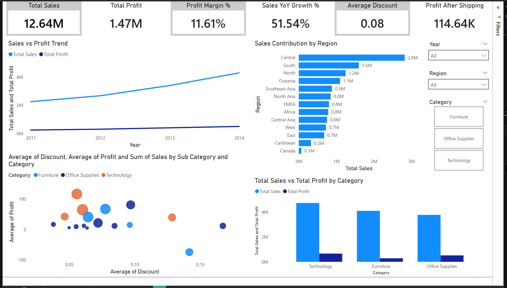
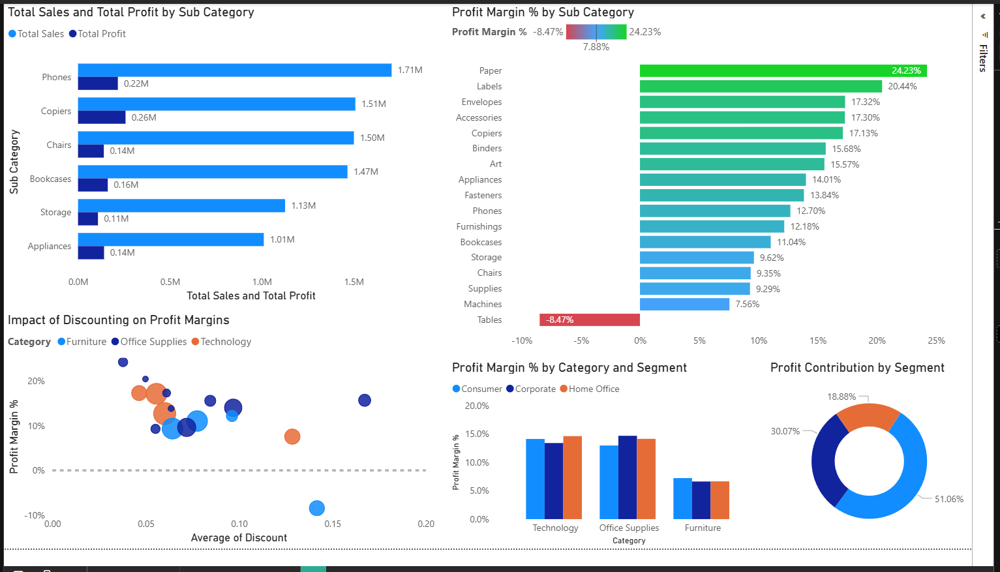

# 📊 Superstore Sales & Profitability Analysis

## 📌 Project Overview
This project presents an end-to-end **sales and profitability analysis** using retail transaction data.
The objective was to identify **margin pressure, discount impact, and unprofitable growth areas**, and convert insights into **actionable business recommendations**.

The project is structured to reflect **real-world business intelligence workflows**, not just dashboard creation.

---

## ❓ Business Problem
Despite strong revenue growth, profitability did not scale proportionally.

Key questions addressed:
- Are we growing profitably?
- Which products and segments drive or erode margins?
- How does discounting affect profit performance?

---

## 🗂 Dataset
- **Source:** Superstore retail dataset  
- **Records:** 51,290 transactions  
- **Period:** 2011–2014  
- **Granularity:** Order-line level  

---

## 🛠 Tools Used
- **Power BI** — data modeling, DAX measures, interactive dashboards  
- **CSV / Excel** — raw dataset  
- **Documentation & presentation tools** — business communication  

---

## 📈 Dashboard Overview

### Page 1 — Executive Overview
- Total Sales: **12.64M**
- Total Profit: **1.47M**
- Profit Margin: **11.6%**
- Sales vs Profit trend
- Category and regional performance

### Page 2 — Profitability Deep Dive
- Category and segment margin structure
- Sub-category margin ranking
- Discount vs profit analysis
- High-sales but low-profit identification
- Segment-wise profit contribution

---

## 🖼 Dashboard Preview

  

  

---

## 🔍 Key Insights
- Sales grew ~90% over four years, while margins remained thin (~11.6%)
- Discounting showed a negative correlation with profit (≈ –0.32)
- Certain sub-categories (e.g., Tables) operated at **negative margins (~–8.5%)**
- A small number of products contributed disproportionately to total profit
- Profit contribution varied significantly by customer segment

---

## 🧠 Business Recommendations
- Introduce discount guardrails for low-margin products
- Reprice or restructure loss-making sub-categories
- Prioritize high-margin products in promotions
- Apply segment-specific pricing strategies
- Track margin-based KPIs alongside sales metrics

---

## 📂 Repository Structure
superstore-sales-profitability-analysis/
├── Dashboard/
│ └── Superstore_Sales_Profitability.pbix
├── Dataset/
│ └── superstore.csv
├── Documents/
│ ├── Business_Story.pdf
│ ├── Analysis_Discussion.pdf
│ └── Action_Plan.pdf
├── Presentation/
│ └── Sales_Profitability_Insights.pdf
├── Screenshots/
│ ├── dashboard_page1.png
│ └── dashboard_page2.png
└── README.md

---

## ▶️ How to Use This Project
1. Open the `.pbix` file in **Power BI Desktop** for interactive analysis  
2. Refer to documents for detailed reasoning and action plans  
3. Use the presentation for stakeholder communication  

---

## ✅ Project Status
- Dashboard complete
- Analysis and documentation complete
- Ready for portfolio and off-campus applications
